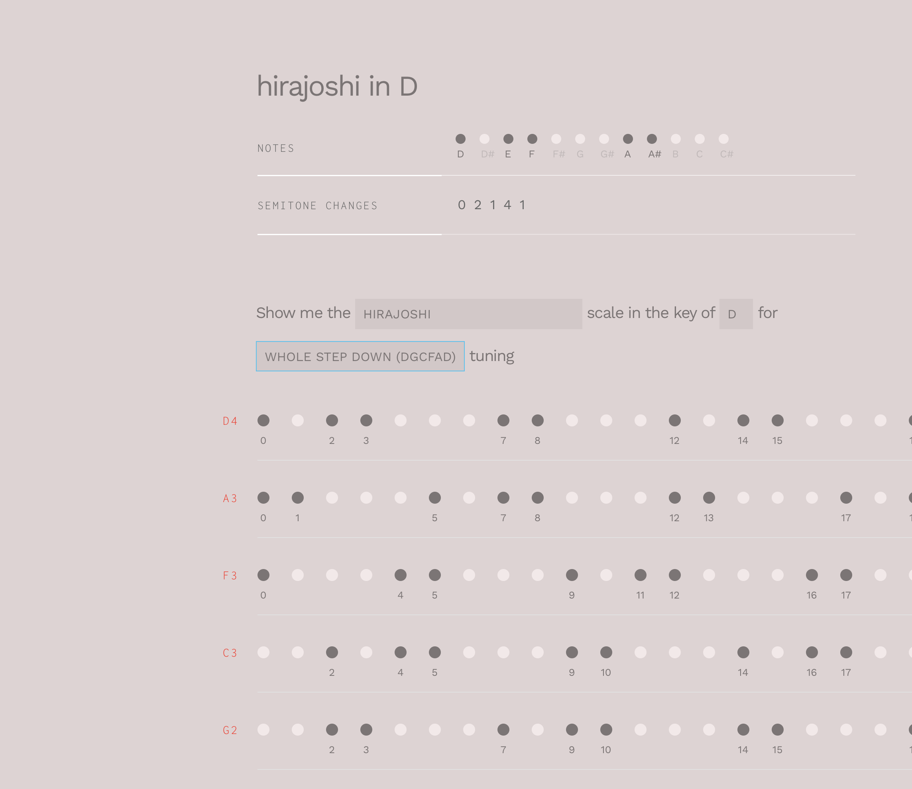

# dots and frets

Dots and Frets is a visualization of music scales for the guitar fretboard. I made this to hack music theory to learn guitar faster.

---

This project was bootstrapped with [Create React App](https://github.com/facebook/create-react-app).

## Getting started

In the project directory, you can run:
### `yarn`

Installs packages this project relies on.

### `yarn start`

Runs the app in the development mode. 
Open [http://localhost:3000](http://localhost:3000) to view it in the browser.
